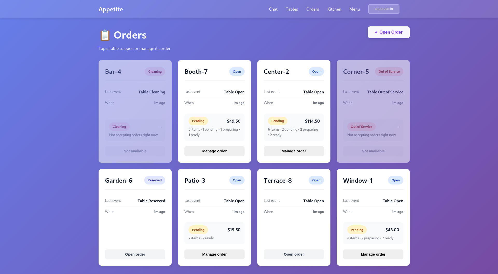

# Appetite

[](https://github.com/appetiteclub/appetite/actions/workflows/test.yml)
[](https://codecov.io/gh/appetiteclub/appetite)


<p align="right"><small><a href="docs/gallery/index.md">See more in the gallery</a></small></p>

A restaurant venue manager built with Go microservices, focusing on real-time operations and kitchen coordination.

---

## Installation

### Clone
```bash
git clone https://github.com/appetiteclub/appetite.git
cd appetite
```

### Run
To quickly start all available services locally:
```bash
make run-all
```

This command builds all components and starts the local stack (Admin, AuthN, AuthZ, Table).
Logs for each service are stored in their respective folders under `services/`.

On the first run, the console will display the generated user and password to access the interface and explore the current implementation.
