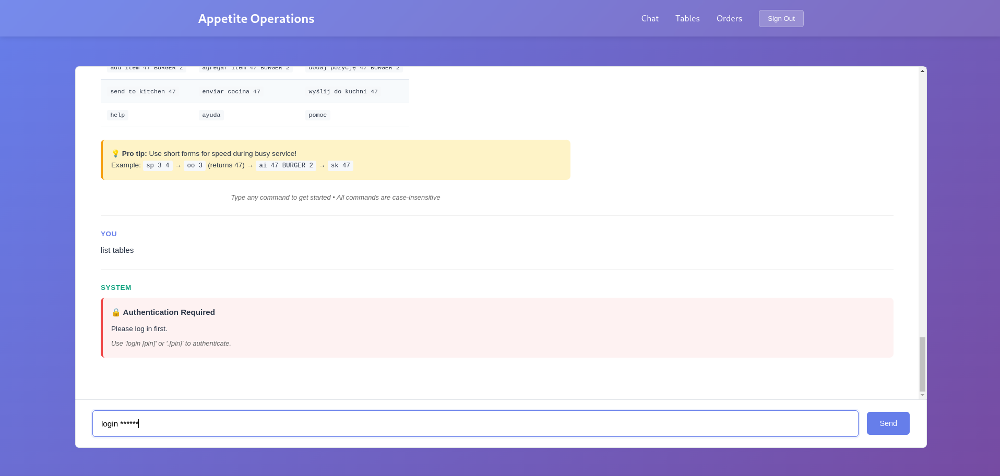
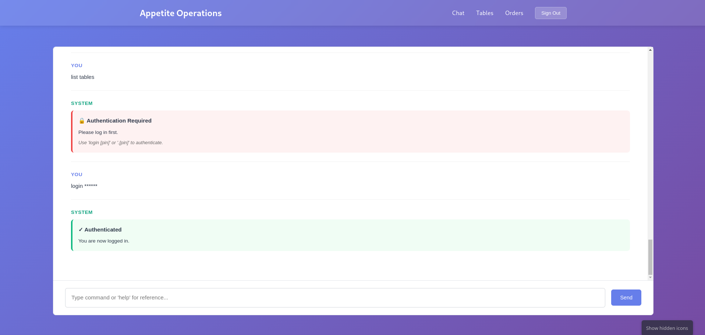

# Gallery

## Public Operations Interfaces

Views from the public-facing operational interfaces used by staff.

### Operations Sign In

### Operations Dashboard

### Operations Chat

### Help Command

### Chat - Sign In Required

### Chat - Signed In

### List Tables

### List Orders

### Chat Exit

## Admin Interface

Internal administration interface for managing users and system configuration.

### Admin Sign In (Dark Mode)

### Admin - List Users

### Admin - Generate PIN

## Development

### Running Services

