# Gallery

## Public Operations Interfaces

Views from the public-facing operational interfaces used by staff.

### Operations Sign In
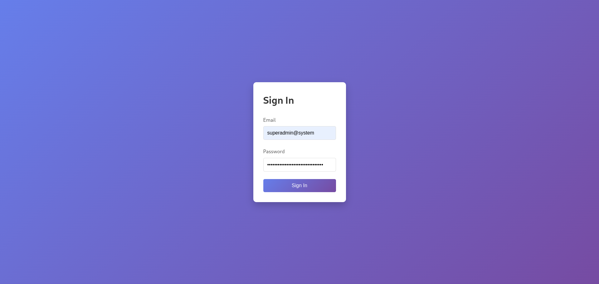

### Operations Dashboard
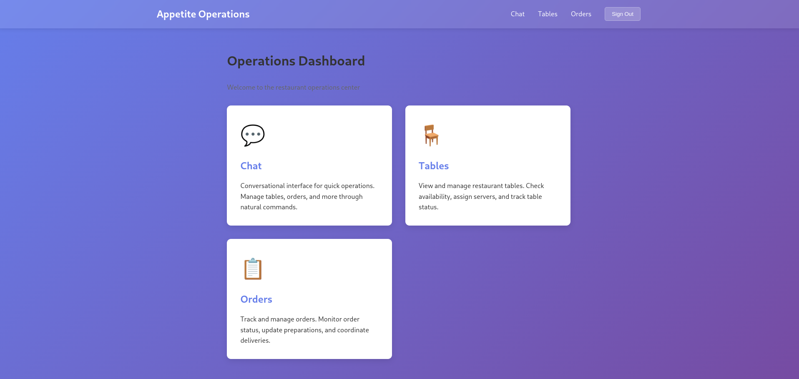

### List Tables
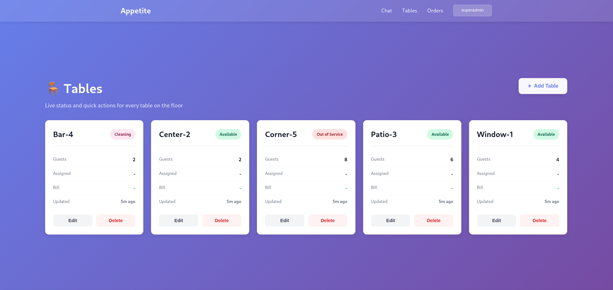

### Operations Chat
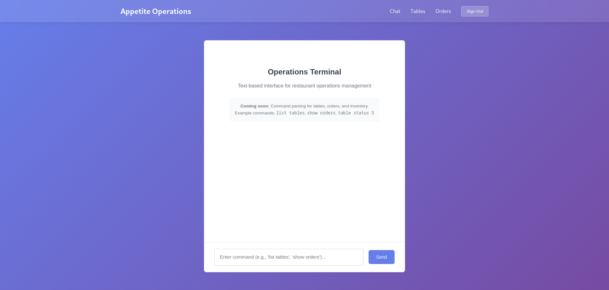

### Chat - Login
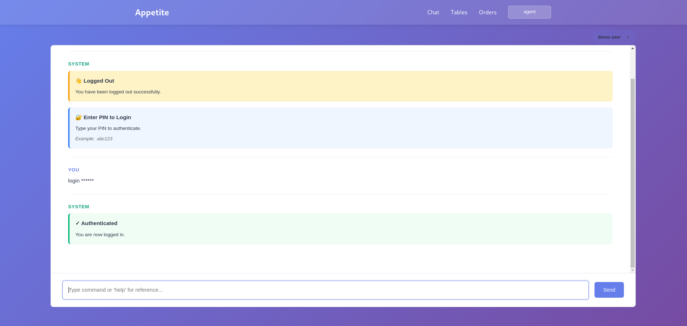

### Help Command
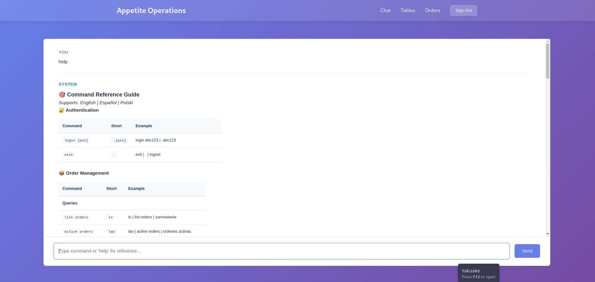

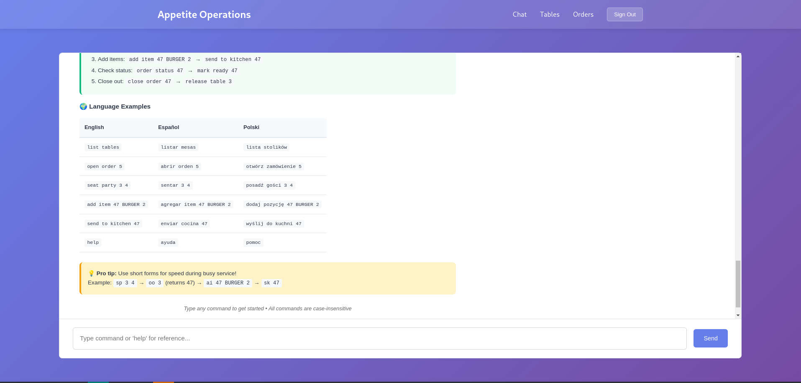

### List Tables
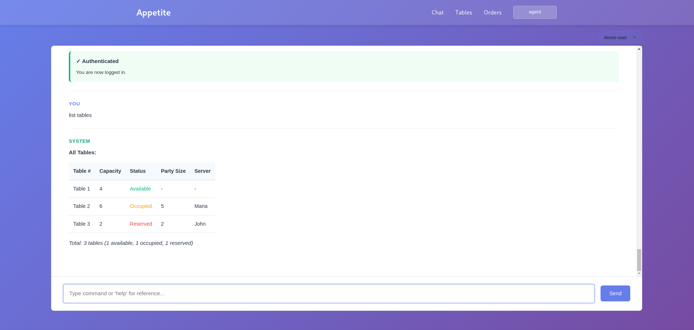

### List Orders
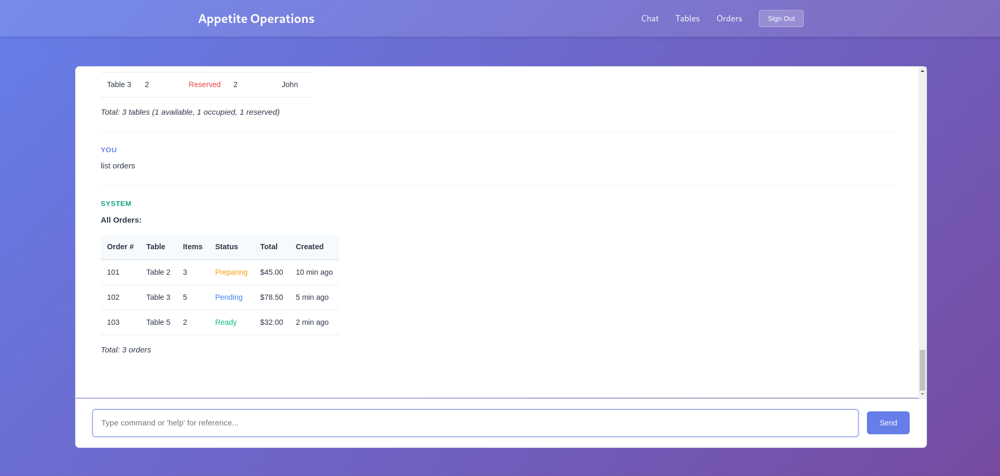

### List Menu
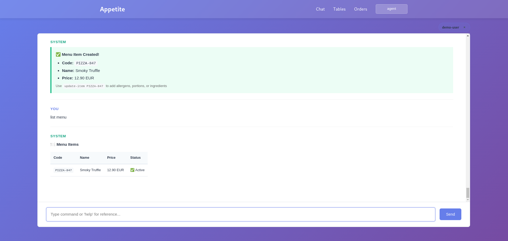

### New Menu Item - Step 1
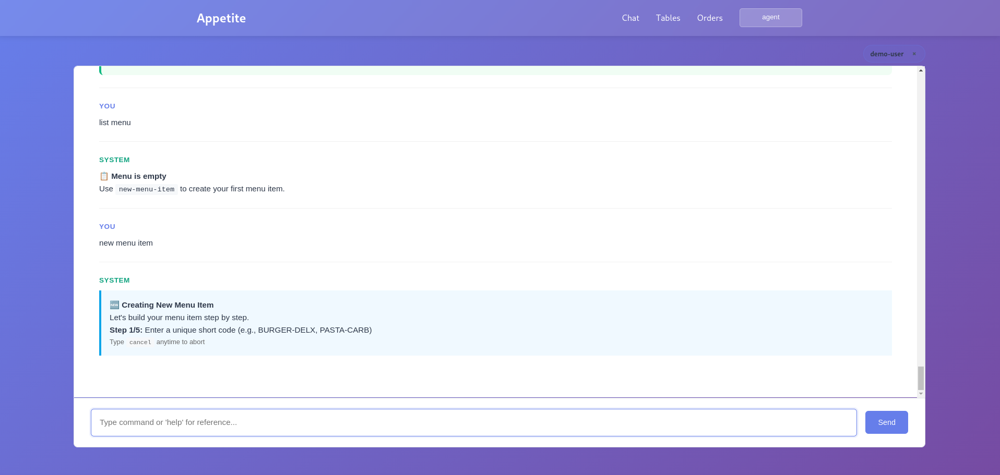

### New Menu Item - Step 2
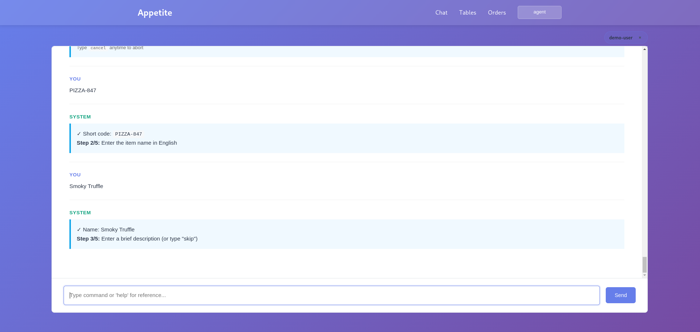

### New Menu Item - Step 3
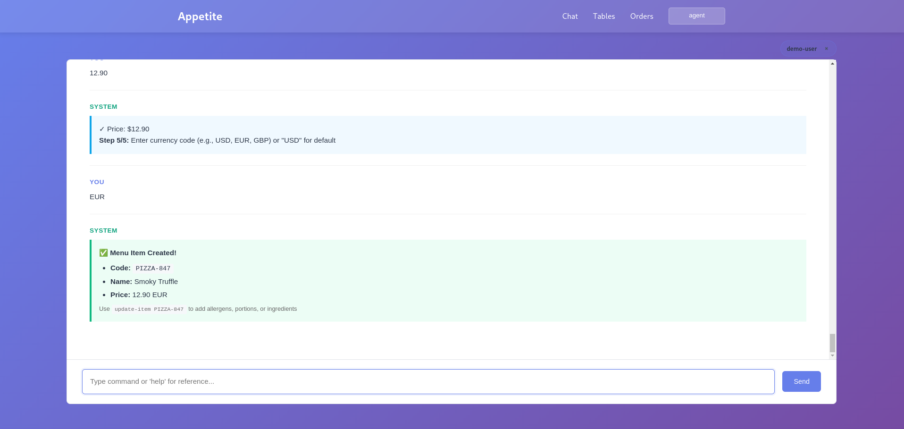

### Chat Exit
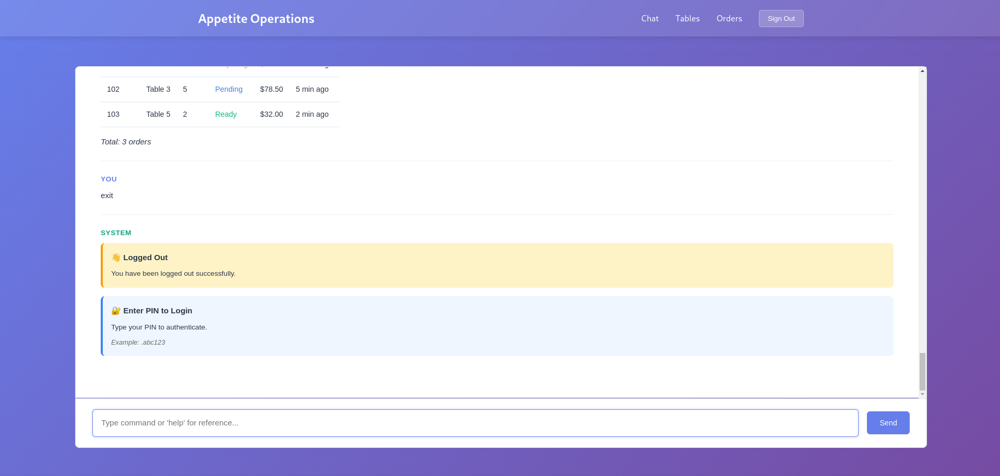

## Admin Interface

Internal administration interface for managing users and system configuration.

### Admin Sign In (Dark Mode)
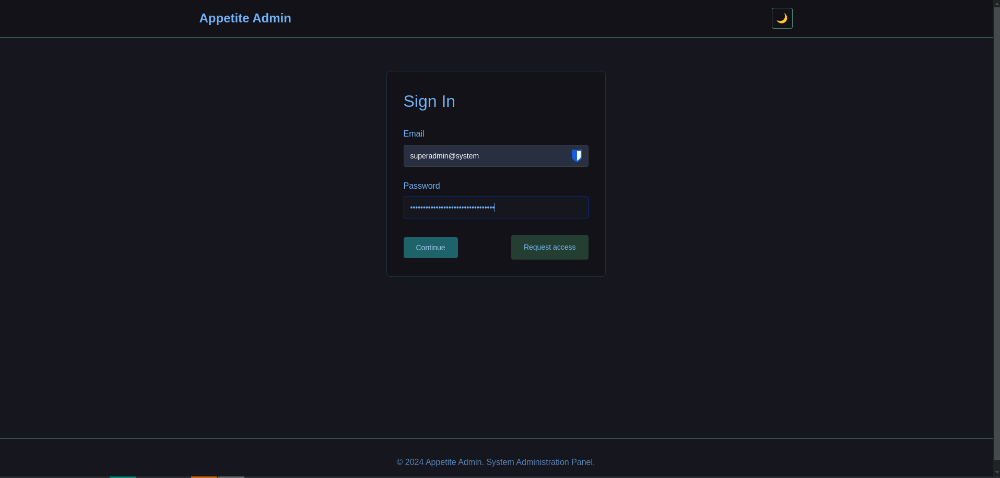

### Admin - List Users
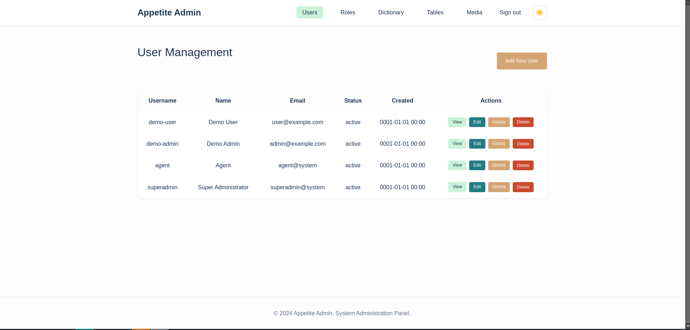

### Admin - Generate PIN
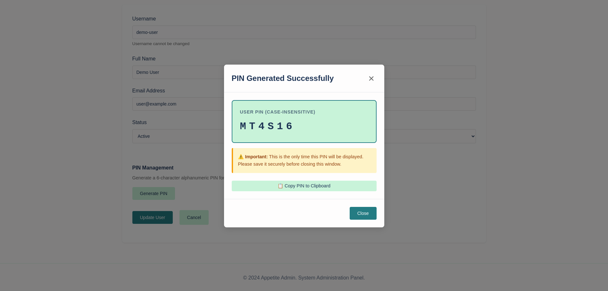

## Development

### Running Services
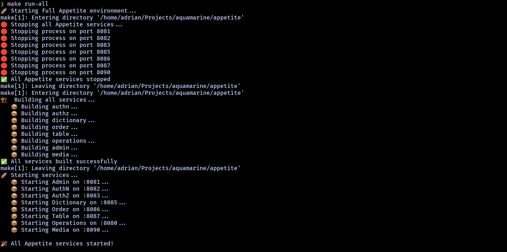
